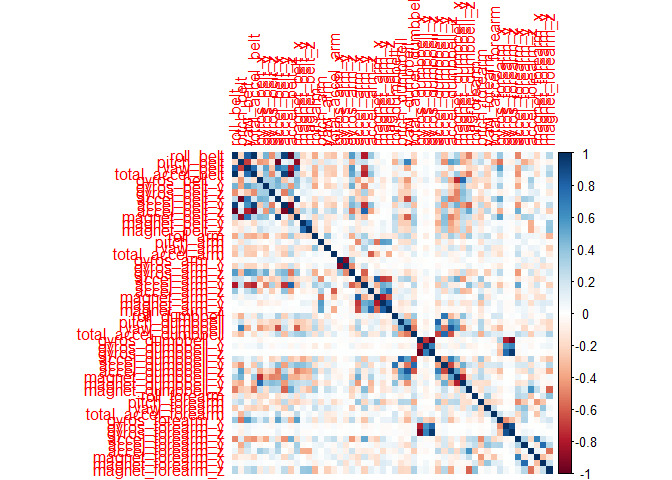
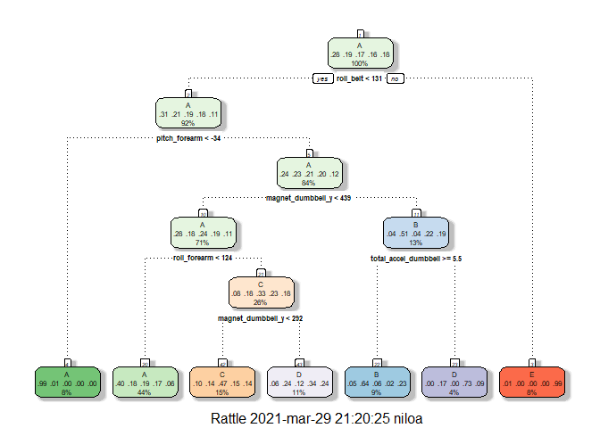
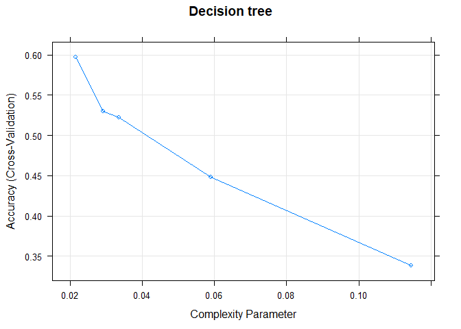
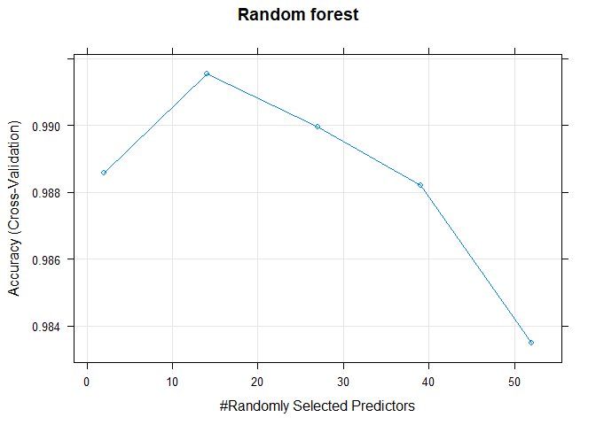
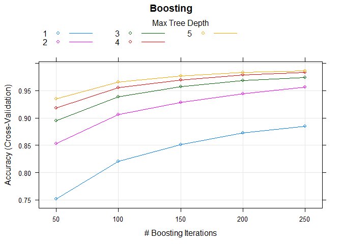

## Overview

This report focuses on the Human Activity Recognition (HAR) field using data from weight lifting exercises (Unilateral Dumbbell Biceps Curl) measured with accelerometers, placed in different places (belt, forearm, arm, and dumbell) in the body of six volunteers. 

The goal of the report is to predict the manner in which the subjects did the exercise, according to the following quality of execution classes (more info [here](http://groupware.les.inf.puc-rio.br/har)).

- **A**:	 exactly according to the specification
- **B**:	 throwing the elbows to the front
- **C**:	 lifting the dumbbell only halfway
- **D**:	 lowering the dumbbell only halfway
- **E**:	 throwing the hips to the front

There have been provided two data sets for training and testing the models, each of them containing an observations set of 160 features, and the predicted variable is labeled as `classes`.

Four models have been generated -- using trees, random forest, boosting and support vector machine techniques -- and their accuracy have been assessed in order to choose the best one to predict the exercises quality of execution using the available features. The model obtained using random forest showed the best accuracy.

## Loading and cleaning the data

[Training](https://d396qusza40orc.cloudfront.net/predmachlearn/pml-training.csv) and [testing](https://d396qusza40orc.cloudfront.net/predmachlearn/pml-testing.csv) data sets has been provided for download and, once downloaded, were loaded into `R`.


```r
#loading used packages
library(caret)
library(dplyr)
library(corrplot)
library(rattle)
```


```r
#loading data
training <- read.csv("C:\\Users\\niloa\\Documents\\Data Science\\Curso8_practical machine learning\\project\\pml-training.csv")
testing <- read.csv("C:\\Users\\niloa\\Documents\\Data Science\\Curso8_practical machine learning\\project\\pml-testing.csv")
dim(training);dim(testing)
```

```
## [1] 19622   160
```

```
## [1]  20 160
```

One can notice that training set has a total of 19622 observations, while testing set has a total of 20 observations. Therefore, the training set has been splitted into training and validation sets.

But first, the training data set has been cleaned by removing the columns with more than 60% of NAs and with low variability. The idea was to imput the remaining NAs with k nearest neighbours.


```r
training <- training[,colMeans(is.na(training))<.6]
any(is.na(training))#there is no NAs anymore
```

```
## [1] FALSE
```

```r
#removing variables that are not related with the outcome
training <- training[,-c(1:7)] 
#removing near zero variance variables, if any
zeroVar <- nearZeroVar(training)
training <- training[,-zeroVar]
dim(training)
```

```
## [1] 19622    53
```

```r
training=mutate(training,classe=factor(classe))#classe into factor
```

Then the training set was splitted into training and validation, since after cleaning there were no NAs on the data set.


```r
set.seed(1225)
inValid <- createDataPartition(y=training$classe,p=0.70, list=FALSE)
trainingSub <- training[inValid,]
validation <- training[-inValid,]
dim(trainingSub); dim(validation)
```

```
## [1] 13737    53
```

```
## [1] 5885   53
```

The training and validation data sets have been used to build the models and the testing data set was used to asses the accuracy of the chosen model in the training phase.

## Building the models

There have been built four prediction models and the most accurate one was chosen. In each one cross-validation was used in order to choose the best features set by defining `trainControl()` parameters. 


```r
#defining training control as cross validation with 3 folds
control <- trainControl(method = "cv", number=3)
```

Then the models have been built using the `caret()` package. Notice that, for each model, the parameter `tuneLength` has been set as 5. This parameter indicates the number of different values to try for each feature tuning (reference [here](https://www.listendata.com/2015/03/caret-package-implementation-in-r.html#:~:text=There%20are%20two%20ways%20to,For%20example%2C%20mtry%20for%20randomForest.)).

#### Trees


```r
#training
set.seed(123)
modelTR<-train(classe~., data = trainingSub, method = "rpart", trControl = control,tuneLength = 5)
#validating
predTR<-predict(modelTR,newdata=validation)
#accuracy
accTR<-confusionMatrix(predTR,validation$classe)$overall[1]
```

#### Random Forest


```r
#training
set.seed(456)
modelRF<-train(classe~., data = trainingSub, method = "rf", trControl = control,tuneLength = 5)
#validation
predRF<-predict(modelRF,newdata=validation)
#accuracy
accRF<-confusionMatrix(predRF,validation$classe)$overall[1]
```

#### Boosting


```r
#training
set.seed(789)
modelBST<-train(classe~., data = trainingSub, method = "gbm", 
                trControl = control, verbose = F,tuneLength = 5)
#validation
predBST<-predict(modelBST,newdata=validation)
#accuracy
accBST<-confusionMatrix(predBST,validation$classe)$overall[1]
```

#### Support vector machine


```r
#training
set.seed(1001112)
modelSVM<-train(classe~., data=validation, method="svmLinear", trControl = control, 
                tuneLength = 5, verbose = F)
#validation
predictSVM<-predict(modelSVM, validation)
#accuracy
accSVM<-confusionMatrix(predictSVM,validation$classe)$overall[1]
```

#### Accuracy and expected error

After validating the models, the accuraccy of each one has been obtained.


```
##                         Accuracy
## Trees                  0.5539507
## Random Forest          0.9960918
## Boosting               0.9906542
## Support Vector Machine 0.7974511
```

Random forest model has shown accuracy of 0.9961, the highest on validation data, and an out of sample error of 0.0039. Therefore, this model has been the chosen one to predict `classe` in the test data set.

## Prediction and expected error

Using the random forest model the `classe` outcome has been predicted in the `testing` data set.


```r
#predicting
predTest<-predict(modelRF, testing)
predTest
```

```
##  [1] B A B A A E D B A A B C B A E E A B B B
## Levels: A B C D E
```


## Appendix

1. Correlation matrix

<!-- -->

2. Decision tree

<!-- -->

3. Features selection

<!-- -->

<!-- -->

<!-- -->

